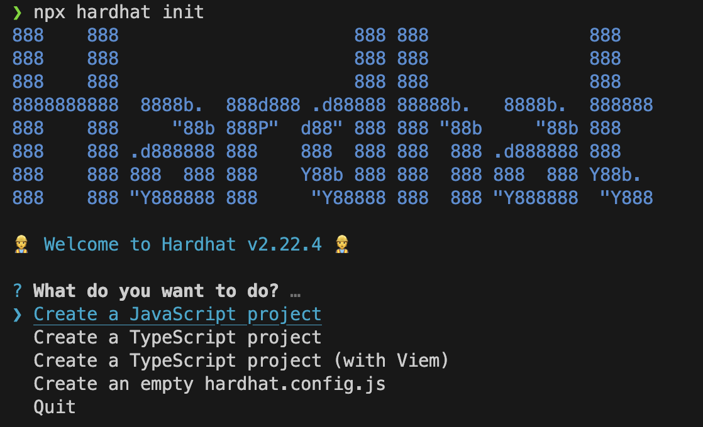

# 2. 솔리디티 개발 환경 설정

## 도구 설치 및 로컬 개발 환경 구축

### 1) Node.js 및 NPM 설치
Node.js와 NPM(Node Package Manager)을 설치 합니다. 이는 솔리디티 개발 도구와 프레임워크를 설치하고 실행하는 데 필요합니다.

- Node.js 다운로드: [Node.js 공식 사이트](https://nodejs.org/en)
- 설치 후 버전 확인

    ```bash
    node -v
    npm -v
    ```

### 2) 프로젝트 디렉토리 생성 및 Hardhat 설치
새 프로젝트 디렉토리를 생성하고, Hardhat을 설치합니다.

Hardhat은 이더리움 기반의 스마트 컨트랙트 개발을 도와주는 개발 환경으로, 개발자가 스마트 컨트랙트 및 DApp 구축 과정 중 반복 작업을 관리하고 자동화하는데 도움을 줍니다.

Hardhat은 개발시 도움을 주는 로컬 Ethereum 네트워크인 Hardhat Network도 함께 포함하고 있어, 이를 통해 스마트 컨트랙트를 **배포하고 테스트하고 코드를 디버깅** 할 수 있습니다.

- 프로젝트 디렉토리 생성:

    ```bash
    mkdir MySolidityProject
    cd MySolidityProject
    ```
- Hardhat 설치:

    ```bash
    npm install --save-dev hardhat
    ```

### 3) Hardhat 초기화
- Hardhat 초기화:
    ```bash
    npx hardhat init
    ```
    초기화 명령을 실행하면 여러 옵션이 나타납니다.

    </img>

### 4) Hardhat 설정 파일 수정
hardhat.config.js 파일이 생성되었을 것입니다. 여기서 필요한 설정을 추가하거나 변경할 수 있습니다.

- Solidity 버전 설정
- 네트워크 (로컬, 테스트, 메인넷 등) 설정
- 경로 (소스 코드, 테스트 파일, 캐시, 아티팩트 등) 설정
- 플러그인 설정

### 5) 스마트 계약 작성
초기화 단계에서 'Create an empty hardhat.config.js'를 제외한 다른 선택지로 진행했을 경우 'contracts' 디렉토리가 자동으로 생성되었을 것입니다.

(아닌 경우 하위 경로에 'contracts' 디렉토리를 생성해줍시다.)

'contracts' 디렉토리에 스마트 계약 파일(.sol)을 작성합니다.

- 'contracts' 디렉토리에 MyContract.sol 파일 생성:

    ```solidity
    // contracts/MyContract.sol
    pragma solidity ^0.8.0;

    contract MyContract {
        string public message;

        constructor(string memory initialMessage) {
            message = initialMessage;
        }

        function updateMessage(string memory newMessage) public {
            message = newMessage;
        }
    }
    ```

### 6) 스마트 계약 컴파일
- 컴파일 명령 실행:

    ```bash
    npx hardhat compile
    ```

### 7) 로컬 이더리움 네트워크 시작
- 로컬 네트워크 시작:

    ```bash
    npx hardhat node
    ```
    로컬 네트워크를 시작하면 나의 로컬 환경에서만 작동하는 가상의 테스트 네트워크가 열리고 20개의 테스트 계정이 생성됩니다.

    > ***[주의]*** Hardhat에서 기본적으로 제공하는 테스트 계정들 프라이빗 키가 공개되어 있기 때문에 메인넷 또는 다른 실제 네트워크에서 사용할 경우 자금이 손실될 수 있습니다.

### 8) 스마트 계약 배포 스크립트 작성 및 배포
'scripts' 디렉토리에 배포 스크립트를 작성하고, 로컬 네트워크에 스마트 계약을 배포합니다.

- 'scripts' 디렉토리에 deploy.js 파일 생성:

    ```js
    // scripts/deploy.js
    async function main() {
        const MyContract = await ethers.getContractFactory("MyContract");
        const myContract = await MyContract.deploy("Hello, World!");

        await myContract.deployed();

        console.log("MyContract deployed to:", myContract.address);
    }

    main()
    .then(() => process.exit(0))
    .catch((error) => {
        console.error(error);
        process.exit(1);
    });

    ```

- 배포 명령 실행:

    ```bash
    npx hardhat run scripts/deploy.js --network localhost
    ```

<br/>

> Hardhat의 대표 기능 중 하나인 테스트와 지정 네트워크에서의 배포는 [4. 테스트 및 배포]에서 다뤄보도록 하겠습니다.

<br/>

## Scaffold-ETH 설치 및 사용 방법